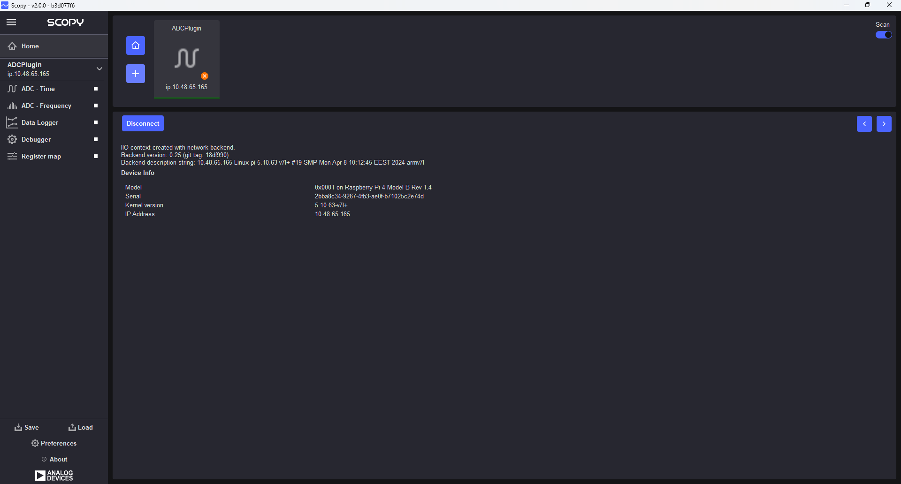
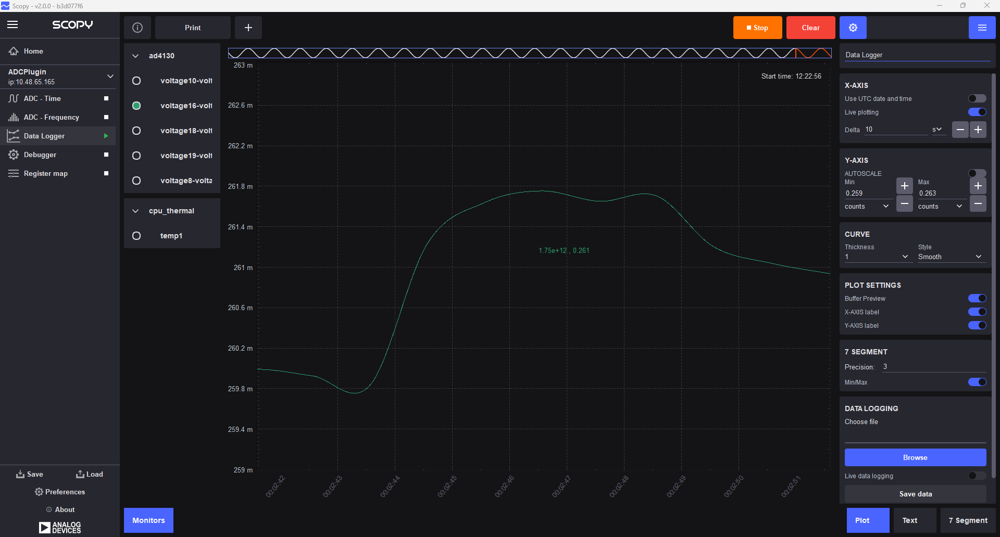
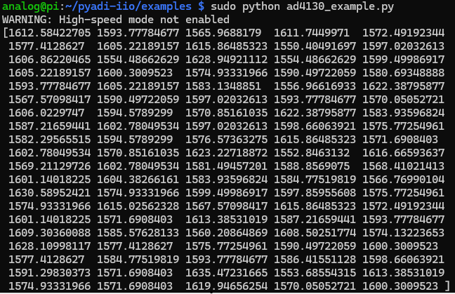

.. _eval-ad4130-8-pmdz:

EVAL-AD4130-8-PMDZ
==================

Minimalist 8-channel, 24-Bit, sigma-delta ADC with PGA and FIFO SPI PMOD board
""""""""""""""""""""""""""""""""""""""""""""""""""""""""""""""""""""""""""""""

Overview
--------

The :adi:`EVAL-AD4130-8-PMDZ` is a compact, low-cost, Pmod-compatible
evaluation board for the :adi:`AD4130` ultra low power, high precision,
measurement solution for low bandwidth battery operated applications. The fully
integrated analog front end (AFE) includes a multiplexer for up to 16
single-ended or eight differential inputs, programmable gain amplifier (PGA),
24-bit sigma-delta (Σ-Δ) analog-to-digital converter (ADC), on-chip reference
and oscillator, selectable filter options, smart sequencer, sensor biasing and
excitation options, diagnostics, and newly added features to improve the
battery-operated lifetime (more than 5 years on a coin cell), that is, a first
in, first out (FIFO) buffer and duty cycling.

- Smart transmitters
- Wireless battery and harvester powered sensor nodes
- Portable instrumentation
- Temperature measurement: thermocouple, RTD, thermistors
- Pressure measurement: bridge transducers
- Healthcare and wearables

The AD4130-8 allows users to measure low frequency signals
with a current consumption of 28.5 μA (gain = 1) and 32.5 μA
(gain = 128) while continuously converting, and even lower average
currents when using one of the duty cycling options. The AD4130-8
can be configured to have 8 differential inputs or 16 single-ended or
pseudo differential inputs, which connect to a crosspoint multiplex-
er, where any input pair can become a measurement channel input
to the PGA and ADC.

Together with the reduced current consumption, the integration of
an on-chip FIFO buffer can be used in tandem with the smart
sequencer, to enable the AD4130-8 to become an autonomous
measurement system, which allows the microcontroller to sleep for
extended periods.

Intelligent interrupt functionality gives the user a greater confidence
in both error detection and safety. The user can enable an interrupt
signal to trigger when the samples in the FIFO reach a predefined
value or when a user programmable threshold is exceeded

.. image:: ad4130-pmod.png
   :width: 350px

Input and Output Connections and Configurations
-----------------------------------------------

The PMOD board is small in size with dimensions approximately 2 cm in width
by 6.7 cm in length.

Pmod Processor Connector
^^^^^^^^^^^^^^^^^^^^^^^^

The PMOD interface is a series of standardized digital interfaces for various
digital communication protocols such as SPI, I2C, and UART. These interface
types were standardized by Digilent, which is now a division of National
Instruments. Complete details on the Pmod specification can be found on the
`Digilent Pmod landing page <https://digilent.com/reference/pmod/start>`__.

The specific interface used for the EVAL-AD4130-8-PMDZ boards is the extended
SPI. In general ADI has adopted the extended SPI connector for all PMOD devices
which have an SPI interface. It provides flexibility to add interrupts, general
purpose I/O, resets, and other digitally controlled functions.

.. csv-table:: PMOD Pinout
    :file: ad4130-pmod-pinout.csv

AD4130 Interrupt Pins
^^^^^^^^^^^^^^^^^^^^^

The EVAL-AD4130-8-PMDZ features three interrupt pins that can be used as external 
indicators for user-defined events. These PMOD interrupt pins are internally
connected to the single interrupt output of the AD4130, and can be configured 
via software to signal either a Data Ready or FIFO Interrupt condition.

These interrupt signals are accessible through the SPI PMOD header. For detailed
information on individual status flags, their meanings, and how to configure 
the chip to generate specific interrupts, please refer to the :adi:`AD4130`` 
data sheet.

Power Supply Considerations and Configuration
---------------------------------------------

When using the EVAL-AD4130-8-PMDZ board, the 3.3V power supply is provided 
directly by the host platform to which it is connected. Most PMOD-compatible 
host boards can supply at least 100 mA, which is more than sufficient for the 
power requirements of the EVAL-AD4130-8-PMDZ.

Device Driver and Software Support
----------------------------------

Two device drivers and corresponding software solutions are available for the 
EVAL-AD4130-8-PMDZ:

**AD4130 no-OS Driver**

   * The :git-no-OS:`AD4130 no-OS driver <main:drivers/afe/ad413x>` is used
     in bare-metal applications, typically running on low-power, embedded
     microcontrollers.

   * The :git-no-OS:`AD4130 no-OS example project <main:projects/ad413x>`
     uses the AD4130 no-OS driver and has several configuration options:

.. ADMONITION:: Download

   A zip file containing prebuilt programming files for the no-OS example project,
   targeting platforms below are available at:
   :git-no-OS:`EVAL-AD4130-8-PMDZ.zip <releases/download/last_commit/eval-ad4130-8-pmdz.zip+>`.

   More details are provided in the platform-specific sections below.

**AD4130 Linux Driver**

* The :git-linux:`AD4130 Linux driver <main:drivers/iio/adc/ad4130.c>` is used in
  applications running the Linux operating system, typically on larger processors
  and SoC devices.
* The AD4130 Linux driver uses the Industrial Input/Output (IIO) framework,
  greatly simplifying the development of application code via the cross-platform
  Libiio library, which is written in C and includes bindings for Python, MATLAB,
  C#, and other languages. Application code can run directly on the platform
  board, communicating with the device over the local backend, or from a remote
  host over the network or USB backends.

System Setup Using Raspberry Pi
-------------------------------

The EVAL-AD4130-8-PMDZ can be used with a Raspberry Pi.

Demo Requirements
^^^^^^^^^^^^^^^^^

The following is a list of items needed in order to replicate this demo.

-  **Hardware**

   -  :adi:`EVAL-AD4130-8-PMDZ <AD4130>`
   -  :adi:`PMOD to Raspberry Pi Adapter (PMD-RPI-INTZ) <PMD-RPI-INTZ>`
   -  Raspberry PI Zero, Zero W, 3B+, or 4
   -  16GB (or larger) Class 10 (or faster) micro-SD card
   -  5Vdc, 2.5A power supply with micro USB connector (USB-C power supply for Raspberry Pi 4)
   -  User interface setup (choose one):

      -  HDMI monitor, keyboard, mouse plugged directly into Raspberry Pi
      -  Host Windows/Linux/Mac computer on the same network as Raspberry Pi

-  **Software**

   - :dokuwiki:`Kuiper Linux Image <resources/tools-software/linux-software/adi-kuiper_images/release_notes>`

Loading Image on SD Card
^^^^^^^^^^^^^^^^^^^^^^^^

In order to boot the Raspberry Pi and control the **EVAL-AD4130-8-PMDZ**, you
will need to install ADI Kuiper Linux on an SD card. Complete instructions,
including where to download the SD card image, how to write it to the SD card,
and how to configure the system are provided on the :ref:`kuiper`.

Configuring the SD Card
^^^^^^^^^^^^^^^^^^^^^^^

Follow the configuration procedure under **Configuring the SD Card for
Raspberry Pi Projects** at :ref:`kuiper sdcard`, substituting the
following lines in **config.txt**:

::

   dtoverlay=rpi-ad4130

Setting up the Hardware
^^^^^^^^^^^^^^^^^^^^^^^

To set up the circuit for evaluation, consider the following steps:

#. Connect the **P9** of the **PMOD to Raspberry Pi Interposer** board at the
   male header GPIO pin connector of the **Raspberry Pi** as shown below.

   .. image:: interposer.png
      :width: 500px

#. Attach the EVAL-AD4130-8-PMDZ to the Raspberry Pi Interposer Board via Port P1.

#. Flash the SD card with the appropriate ADI Kuiper Linux image. Insert the 
flashed SD card into the Raspberry Pi's SD card slot.

#. Use an HDMI cable to connect the Raspberry Pi to a monitor via 
the mini-HDMI connector.

#. Plug in a USB keyboard and mouse into the Raspberry Pi's USB ports.

#. Power the Raspberry Pi by connecting a 5V power supply through the micro-USB 
connector. The final setup should look similar to the picture below.

   .. image:: eval-ad4130-8-pmdz_overall_setup.png
      :width: 600px

Application Software 
--------------------

The Libiio is a library used for interfacing with IIO devices and is required
to be installed on your computer.

.. ADMONITION:: Download

   Download and install the latest :git-libiio:`Libiio package <releases+>` on
   your machine.

To be able to connect your device, the software must be able to create a
context. The context creation in the software depends on the backend used to
connect to the device as well as the platform where the EVAL-AD4130-8-PMDZ is
attached. The user needs to supply a **URI** which will be used in
the context creation.

The :ref:`libiio iio_info` command is a part of the libIIO package that reports
all IIO attributes.

Upon installation, simply enter the command on the terminal command line to
access it.

For RPI Direct Local Access:

.. shell::

   $iio_info

For Windows machine connected to Raspberry Pi:

.. shell::

   $iio_info -u ip:<ip address of your ip>

For example, if your Raspberry Pi has the IP address 192.168.1.7, then enter:

.. shell::

   $iio_info -u ip:192.168.1.7

.. NOTE::

   Do note that the Windows machine and the RPI board should be connected to
   the same network in order for the machine to detect the device.

IIO Commands
^^^^^^^^^^^^

There are different commands that can be used to manage and control the device
being used. The :ref:`libiio iio_attr` command reads and writes IIO attributes.

.. shell::

   $iio_attr [OPTION]...

To look at the context attributes on the Raspberry Pi, enter the following command on the terminal:

.. shell::

   $sudo iio_attr -C

The :ref:`libiio iio_reg` command reads or writes SPI or I2C registers in an
IIO device. This is generally not needed for end applications, but can be
useful in debugging drivers. Note that you need to specify a context using the
*-u* qualifier when you are not directly accessing the device via RPI or when
you are using the ADICUP3029 platform.

.. shell::

   $iio_reg -u <context> <device> <register> [<value>]

To read the device ID (register = 0x05) of an AD4130 interfaced via RPI from a
Windows machine, enter the following code on the terminal:

.. shell::

   $iio_reg -u ip:<ip address> ad4130 0x05

Scopy 2.0
^^^^^^^^^

Download and install the latest version of IIO Oscilloscope from:
:git-scopy:`Scopy Installers <releases+>`.

Once done with the installation or an update of the latest Scopy,
open the application. The user needs to supply a URI which will be used in the
context creation and the instructions can be seen from the previous section. 
Click and **+** icon to add a device and enter the URI of your device and then click verify.

.. image:: ad4130-scopy-setup.png
   :width: 600px

After this click on add device and then connect!

You can now go to the *Register map* section and check again the 0X05 register's 
value.

Data Logger
^^^^^^^^^^^
To view ADC readings, navigate to the Data Logger tab on the left side of the 
application. Enable the voltage18 to voltage19 channel and click Run. You should 
observe a stable 2.5V signal, which corresponds to the internal reference 
voltage of the ADC.

.. image:: ad4130-scopy-reference.png
   :width: 600px

Additionally, you can enable the voltage16 to voltage19 channel to visualize 
measurements from the internal temperature sensor. By placing your finger on 
the ADC, you'll notice an increase in the voltage reading, indicating a rise in 
temperature detected by the sensor.

PyADI-IIO
^^^^^^^^^

:ref:`pyadi-iio` is a python abstraction module for ADI hardware with IIO
drivers to make them easier to use. This module provides device-specific APIs
built on top of the current libIIO python bindings. These interfaces try to
match the driver naming as much as possible without the need to understand the
complexities of libIIO and IIO.

Follow the step-by-step procedure on how to install, configure, and set up
PyADI-IIO and install the necessary packages/modules needed by referring to
this :ref:`link <pyadi-iio>`.

Running the example directly on the RPi
^^^^^^^^^^^^^^^^^^^^^^^^^^^^^^^^^^^^^^^

After installing and configuring PyADI-IIO in your machine, you are now ready
to run python script examples. In our case, run the **ad4130_example.py**
found in the examples folder.

.. NOTE::

   Github link for the python sample script:
   :git-pyadi-iio:`AD4130 Python Example <examples/ad4130_example.py>`

.. shell::
   :user: analog
   :group: pi
   :show-user:

   $cd pyadi-iio/examples
   $sudo python ad4130_example.py

Press enter and you will get these readings.

More information and useful links
---------------------------------

-  :adi:`EVAL-AD4130-8-PMDZ Product Page <eval-ad4130-8-pmdz>`
-  :adi:`AD4130 Product Page <AD4130>`
-  :git-no-OS:`EVAL-AD4130-8-PMDZ no-OS projects <eval-ad4130-8-pmdz>`

Schematic, PCB Layout, Bill of Materials
----------------------------------------

.. ADMONITION:: Download

   :download:`EVAL-AD4130-8-PMDZ Design & Integration Files <eval-ad4130-8-pmdz-DesignSupport.zip>`

   * Schematics
   * Bill of Materials
   * Gerber Files
   * Assembly Files
   * Allegro Layout File

Additional Information
----------------------

-  :external+pyadi-iio:doc:`pyadi-iio <index>`
-  :external+scopy:doc:`index`
-  :external+adi-kuiper-gen:doc:`index`

Hardware Registration
---------------------

.. tip::

   Receive software update notifications, documentation updates, view the
   latest videos, and more when you register your hardware.
   `Register <https://my.analog.com/en/app/registration/hardware/eval-ad4130-8-pmdz?&v=Rev%20B>`__
   to receive all these great benefits and more!
