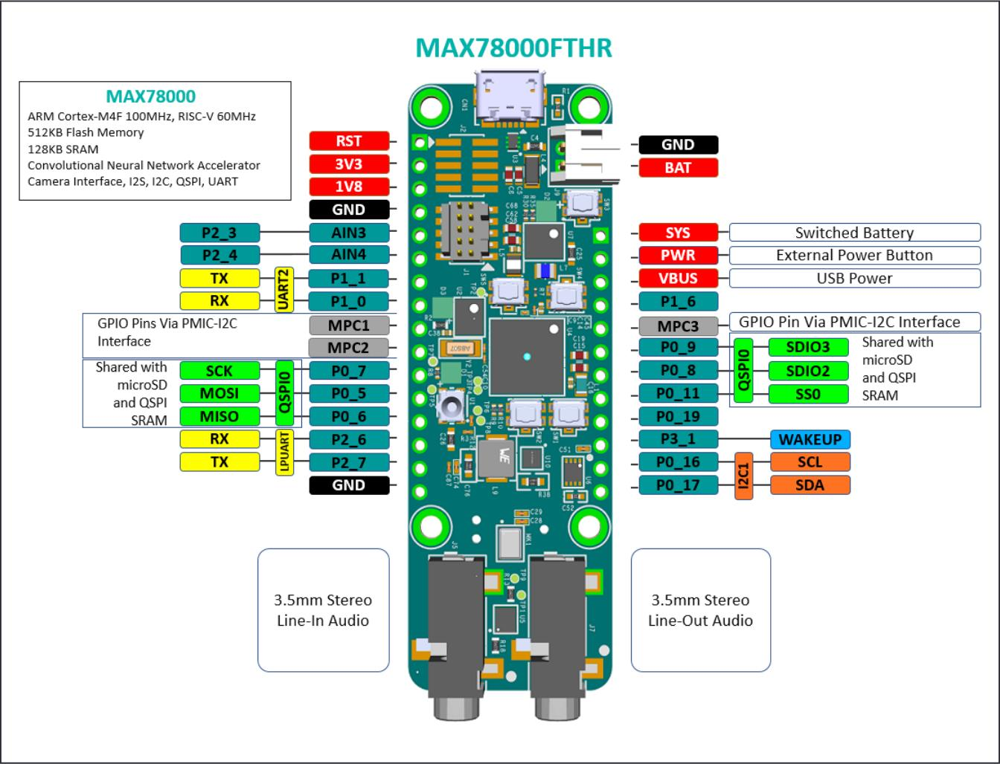
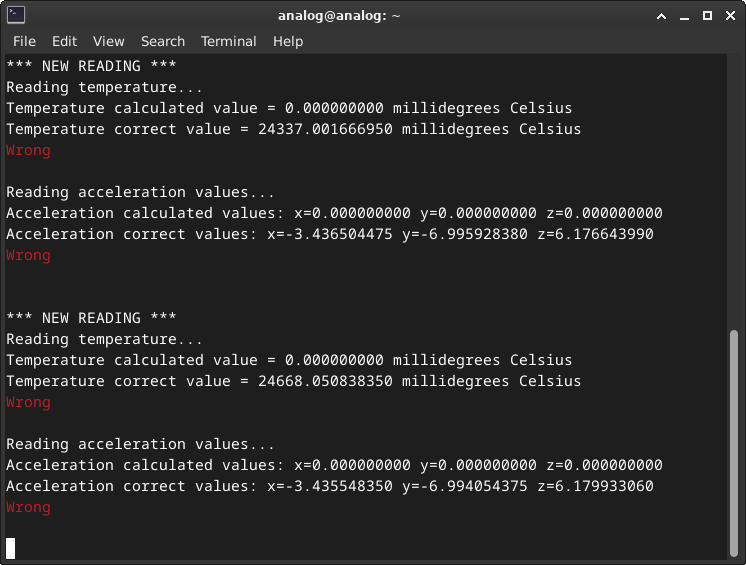
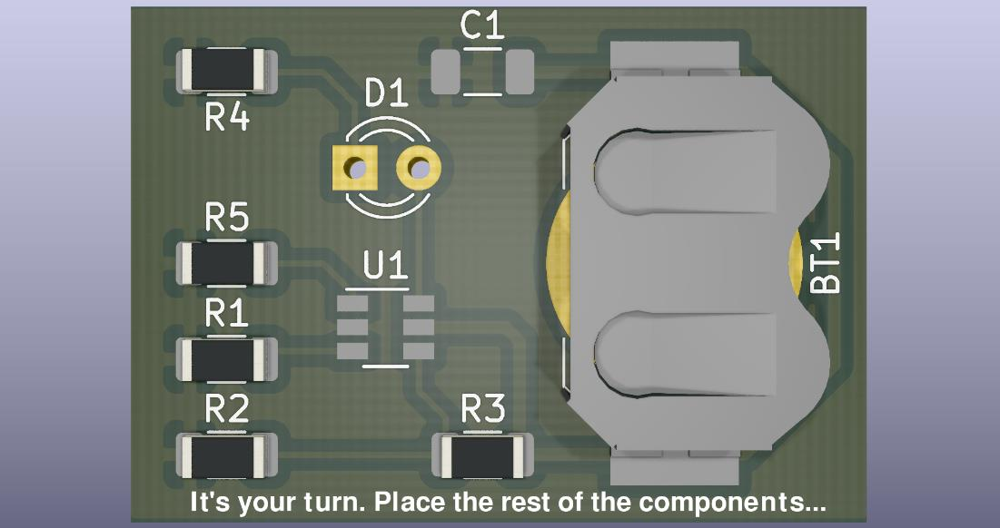

Embedded Baremetal
==================

Introduction
------------

This workshop is designed to explore the fascinating world of baremetal
programming, where you'll learn to operate software that runs directly on the
hardware.
We'll start by understanding what baremetal programming is and why it's
important.
Through interactive demonstrations and hands-on activities, you'll gain
practical experience and see how these concepts apply to real-world projects.
Let's dive in and start our journey into the world of embedded systems!

Theory
------

Baremetal Background
~~~~~~~~~~~~~~~~~~~~

Traditionally, industry chip manufacturers would sell ICs without accompanying
software:

- Chip
- Datasheet
- Pseudocode with an initialization sequence and/or sequence of data acquisition

Complex parts require complex software.

ICs are everywhere.

.. grid::
   :widths: 50% 50%

   .. image:: images/intro.png
      :width: 300
      :alt: no os

   .. image:: images/intro_2.png
      :width: 300
      :alt: no os

ADI addressed this issue and started providing software for its parts as well.

There is a market advantage in selling parts with accompanying software.

Baremetal projects deliverables 10 years ago consisted of:

- A .zip file containing the driver files
- A .zip file containing a project

.. figure:: images/old_project.png
   :align: center
   :width: 500

   Old Drivers structure

What ADI tried to do back then was to write an ADI driver for an ADI part,
provided that we were selling the evaluation board with ADI part on it.
The communication driver would be specific for each microcontroller or system
board we would use: Maxim, Microchip, STM, etc.
The structure was consisted mainly of buffers instantiations and function calls.
The users would have to fill-in the code with their specific functions.

The initial approach had two targets:

- Provide bare-metal ADI drivers for ADI parts to users
- Leverage the driver code in a reference project running on hardware

**Advantages**

- Driver code was MCU independent

**Disadvantages**

- Customer responsibility to port reference project on a different MCU
- .zip file distribution led to no version control and code duplication

**Evolution provided**

- Provide a way for reference projects to run on multiple hardware combinations
- Provide a build system that generates binaries and run them on hardware
- Expose parts as IIO devices to PC applications
- Improve code quality

What is No-OS
~~~~~~~~~~~~~

- A software framework for embedded bare-metal development
- Open-source
- ADI-BSD license
- Free
- Large collection of platform agnostic device drivers for ADI parts
- Significant collection of reference projects leveraging ADI evaluation boards
- Reference projects can run on a wide range of hardware
- Provides IIO enabled devices, making them accessible to PC applications that
  use libiio

What is a No-OS device driver
~~~~~~~~~~~~~~~~~~~~~~~~~~~~~

A No-OS device driver provides the software interface for hardware devices.
Software application can access hardware functionality without knowing in detail
how the driver operates. The register map, bit fields, are directly handled by
the driver, as well as communication interface specific sequences and timings.

- A piece of code implemented in C, in a .c and .h pair, stored in drivers/

- Its programming interface is directly called by the application code

.. figure:: images/api.png
   :align: center
   :width: 500

- Defines its own descriptor structures and init_param

.. figure:: images/struct.png
   :align: center
   :width: 500

- Contains minimum init() and remove() functions -  take as parameter the
  specific init_param structure

- Puts the devide into the desired state
- Allocates memory
- Provides the descriptor for being called in other driver function calls, the remove functions frees the resources allocated by the init()

.. figure:: images/init.png
   :align: center
   :width: 500

- Performs no-OS API calls, does not perform platform specific function calls,
  it's platform agnostic

.. figure:: images/api_write.png
   :align: center
   :width: 500

- Software application can access hardware functionality without knowing in
  detail how the device operates

.. figure:: images/no-os-stack.png
   :align: center
   :width: 300

   No-OS Software Stack

No-OS Platforms
~~~~~~~~~~~~~~~

Platform drivers - represent an implementation of peripheral related no-OS API
on a specific platform.
Platform drivers use vendor HAL - Hardware Abstraction Layer.
No-OS platform drivers are implementations of peripheral no-OS API on a
particular platform.

No-OS modularity allow it to run a lot of its code on different platforms like:

- Xilinx (Zynq7000, ZynqMP, Microblaze)
- Maxim (32650, 32655, 32660, 32670, 78000), ADuCM (3029)
- STM32 (almost any)
- RaspberryPi Pico
- Mbed

.. figure:: images/platform.png
   :align: center
   :width: 600

   No-OS Platform Drivers

No-OS Projects
~~~~~~~~~~~~~~

A project is basically an application that can be built, run and debugged on
hardware

Specifications:

- Located under projects/
- It has a main() function
- It uses drivers/ and drivers/platforms directories
- It uses no-OS API
- It uses various libraries
- User interaction – serial, iio-oscilloscope
- makefiles

Project hardware typically is made of:

- An evaluation board
- A carrier board

No-OS projects are used for:

- ADI parts evaluation
- Starting development based on a no-OS project

IIO Concepts
~~~~~~~~~~~~

What is IIO - is a framework in the Linux kernel designed for devices such as
adcs, dacs, etc..
There is a tree concept inside kernel, there is the context concept which is
specific to a board and has a set of drivers.
Context has a backend associated with it, it can be local or remote.
Is has an attribute associated with it - give various descriptions of the board:
name, version, etc.
Underneath the context comes the device, specific to the board and has also
attributes, along with debug attributes - components you normally don't interact
with and require extra configuration or settings - ex. Advanced adc settings
Devices can have buffers and channels. Buffers are associated with data and the
channels represent the number of paths for signals to be acquired/generated.

The Linux Industrial I/O (IIO) subsystem is intended to provide support for
devices that, in some  sense, are analog-to-digital or digital-to-analog
converters.

Devices that fall into this category are:
- ADCs
- DACs
- Accelerometers, gyros, IMUs
- Capacitance-to-Digital converters  (CDCs)
- Pressure, temperature, and light  sensors, etc.
- RF Transceivers (like the AD9361 /  AD9364 / AD9371 / ADRV9009)
- It can be used on ADCs ranging from a  1MSPS SoC ADC to >5 GSPS ADCs

.. _fig-iio:

.. figure:: images/iio.png
   :align: center
   :width: 500

**Libiio**

It's written in C, but has bindings in Python, C++, etc.
All the high-level apps that talk to libiio are built on top of the stack.
The stack preserves its functionality, because of the way things are built, no
need to change it, for becoming compatible to use with for ex GNU, Matlab, etc.

.. _fig-libiio:

.. figure:: images/libiio.png
   :align: center
   :width: 500

ADXL355 Part
~~~~~~~~~~~~

The ADXL355 is a Low Noise, Low Drift, Low Power, 3-Axis MEMS Accelerometer.

Features:

- Digital SPI and I2C interfaces supported
- 20-bit ADC
- Data interpolation routine for synchronous sampling
- Programmable high- and low-pass digital filters
- 0 g offset vs. temperature (all axes): 0.15 mg/°C maximum
- V\ :sub:`SUPPLY` with internal regulators: 2.25 V to 3.6 V

Hands-on Activity
-----------------

By the end of this workshop, you will learn:

* How to set up a no-OS development environment on Linux
* How to build and flash firmware to MAX78000FTHR
* How to read sensor data via SPI from ADXL355 accelerometer
* How to convert raw register values to meaningful units
* How to expose devices through IIO for PC application interaction

Materials
~~~~~~~~~

* MAX78000FTHR evaluation board
* EVAL-ADXL355-PMDZ accelerometer module
* Jumper wires (6 connections required)
* Raspberry Pi 5 or Linux PC as development workstation
* USB cable for MAX78000FTHR connection

Pre-requisites
~~~~~~~~~~~~~~

The workshop environment can be set up using one of two methods. Choose the
option that best fits your situation:

- **Option 1: Pre-built Kuiper Image** - Recommended for live workshops and
  quick setup. Everything is pre-installed and ready to use.
- **Option 2: Manual Setup** - For self-paced learning on your own Linux
  machine or when you want to understand the full setup process.

Option 1: Pre-built Kuiper Image
++++++++++++++++++++++++++++++++

Use the pre-configured ADI Kuiper image with all tools and dependencies
pre-installed. This is the fastest way to get started.

1. Download the workshop image from:

   https://swdownloads.analog.com/cse/kuiper/kuiperv2.0.0/university-workshops/image_pi5.zip

2. Unzip the downloaded file to extract the image.

3. Write the image to an SD card by following the
   :external+adi-kuiper-gen:ref:`Writing the Image to an SD Card
   <use-kuiper-image>` guide.

4. Insert the SD card into your Raspberry Pi 5 and power it on.

Once the Raspberry Pi 5 boots, the environment is ready. Skip to
:ref:`environment-configuration` to configure the environment variables.

Option 2: Manual Setup
++++++++++++++++++++++

Set up the environment manually on a Raspberry Pi 5 or any Linux PC. This
option is useful for self-paced learning or development.

Clone the workshop repository and run the setup script:

.. code-block:: bash

   git clone https://github.com/romandariana/workshop_baremetal
   cd workshop_baremetal
   chmod +x setup.sh
   ./setup.sh

The setup creates the following directory structure:

.. code-block:: text

   ~/workshop_baremetal/
   ├── setup.sh
   ├── ai8x-synthesis/
   ├── MAX78000SDK/
   │   └── Libraries/
   └── no-OS/
       └── projects/
           └── workshop/

.. _environment-configuration:

Environment Configuration
+++++++++++++++++++++++++

After completing either setup option, configure the environment variables:

.. code-block:: bash

   export MAXIM_LIBRARIES=~/workshop_baremetal/MAX78000SDK/Libraries
   export PLATFORM=maxim
   export TARGET=max78000

.. note::

   Add these exports to your ``~/.bashrc`` to make them persistent across
   terminal sessions.

Example 1: Hello World UART
~~~~~~~~~~~~~~~~~~~~~~~~~~~

This first example demonstrates basic UART communication. The firmware prints
"Hello World" messages to the serial console, confirming that the development
environment is correctly configured.

Open a terminal and navigate to the workshop project directory:

.. code-block:: bash

   cd ~/workshop_baremetal/no-OS/projects/workshop

Clean any previous build artifacts and build the first example:

.. code-block:: bash

   make reset
   make EXAMPLE=example_1

Connect the MAX78000FTHR to one of your workstation's USB ports through an USB
cable.

Flash the firmware to the MAX78000FTHR:

.. code-block:: bash

   make EXAMPLE=example_1 run

Open a new terminal and start the serial monitor:

.. code-block:: bash

   picocom -b 57600 /dev/ttyACM0

You should see "Hello World" messages printed to the console.

.. _fig-example1:

.. figure:: images/example1.png
   :align: center
   :width: 500

.. note::

   Press ``Ctrl+A`` followed by ``Ctrl+X`` to exit picocom.

Example 2: Temperature reading
~~~~~~~~~~~~~~~~~~~~~~~~~~~~~~

For this example, we connect an accelerometer to the microcontroller board using
the provided wires. The scope of this example is to read the temperature from
the accelerometer.

Disconnect the MAX78000FTHR from your workstation's USB port.

Connect the EVAL-ADXL355-PMDZ to MAX78000FTHR using the information below:

.. list-table:: Pin correspondence table
   :header-rows: 1
   :widths: 30 40 30

   * - MAX78000FTHR
     - Signal
     - EVAL-ADXL355-PMDZ
   * - 3V3
     - Digital power
     - 6 or 12
   * - GND
     - Digital ground
     - 5 or 11
   * - P0_11/SS0
     - SPI Chip Select
     - 1
   * - P0_5/MOSI
     - SPI Master Out Slave In
     - 2
   * - P0_6/MISO
     - SPI Master In Slave Out
     - 3
   * - P0_7/SCK
     - SPI Serial Clock
     - 4

Make sure all 6 wires from the pin correspondence table are connected.

You may now plug in the MAX78000FTHR into one of the workstation's USB ports
using the USB cable.

The accelerometer has an internal temperature sensor. This example makes use of
this by reading it and displaying temperature values onto the serial terminal.

Clean any previous build artifacts and build the second example:

.. code-block:: bash

   make reset
   make EXAMPLE=example_2

Make sure you have an active terminal running picocom then load the example:

.. code-block:: bash

   make EXAMPLE=example_2 run

Observe the output being printed every second.

.. _fig-example2:

.. figure:: images/example2.png
   :align: center
   :width: 500

**Challenge**

Change the current format of the printed temperature from millidegrees to
degrees.

**Example**

The current format is: 24668.050838350 millidegrees.

The new format should be 24.66 degrees.

**Hint**

You need to modify example_2.c and then reset, rebuild and reload the program
onto the board. The recommended way to do this is to open the no-OS folder using
your favorite editor and search for example_2.c file.

.. code-block:: bash

   code ~/workshop_baremetal/no-OS

Example 3: Raw-to-readable conversion
~~~~~~~~~~~~~~~~~~~~~~~~~~~~~~~~~~~~~

Read temperature and the acceleration values from ADXL355 and convert the data
from raw values into user readable values.

Make sure you have an active terminal running picocom, then build and flash the
third example:

.. code-block:: bash

   make reset
   make EXAMPLE=example_3
   make EXAMPLE=example_3 run

Notice the output displayed:

.. _fig-example3:

**Challenge**

Compute the temperature and the accelerations using the raw values.

**Hint**

For temperature you need to compute the temp_dividend and temp_divisor.

For accelerometer values you need to compute the x_dividend, y_dividend,
z_dividend and accel_divisor.

You need to modify example_3.c and then reset, rebuild and reload the program
onto the board. The recommended way to do this is to open the no-OS folder using
your favorite editor and search for example_3.c file.

.. code-block:: bash

   code ~/workshop_baremetal/no-OS

The formula for the temperature:

.. math::

   TEMPERATURE = (RAW + OFFSET) \cdot SCALE

.. math::

   TEMPERATURE = \left(RAW + \frac{OFFSET}{OFFSET\_DIV}\right) \cdot \frac{SCALE\_FACTOR}{SCALE\_FACTOR\_DIV}

.. math::

   TEMPERATURE = \frac{(RAW \cdot OFFSET\_DIV + OFFSET) \cdot SCALE\_FACTOR}{OFFSET\_DIV \cdot SCALE\_FACTOR\_DIV}

The formula for the acceleration:

.. math::

   ACCELERATION = RAW \cdot SCALE

.. math::

   ACCELERATION = \frac{RAW \cdot SCALE\_FACTOR\_MUL}{SCALE\_FACTOR\_DIV}

.. list-table:: Parameter correspondence table
   :header-rows: 1
   :widths: 50 50

   * - PARAMETER
     - VALUE
   * - TEMPERATURE OFFSET
     - -2111.25
   * - TEMPERATURE SCALE
     - -110.497238
   * - ACCELERATION SCALE
     - 0.00003824593

.. list-table:: Macro correspondence table
   :header-rows: 1
   :widths: 50 50

   * - MACRO
     - VALUE
   * - ADXL355_TEMP_OFFSET
     - -211125
   * - ADXL355_TEMP_OFFSET_DIV
     - 100
   * - ADXL355_TEMP_SCALE_FACTOR
     - -110497238
   * - ADXL355_TEMP_SCALE_FACTOR_DIV
     - 1000000
   * - ADXL355_ACC_SCALE_FACTOR_MUL
     - 38245
   * - ADXL355_ACC_SCALE_FACTOR_DIV
     - 1000000000

To compute the temperature and the accelerations you can use either the macros
or their values from the above table. The ``ADXL355_TEMP`` macros correspond to
the temperature values, and the ``ADXL355_ACC`` macros correspond to the
acceleration values.

The raw values from the formulas can be found in the source file under the name
``raw_<temp, x, y, z>``.

.. note::

   For the division to be correct, the dividend must be represented on twice
   the number of bits the divisor is represented on, so you need to cast
   explicitly one parameter of the dividend to ``int64_t``.
   Example: ``(int64_t)ADXL355_TEMP_SCALE_FACTOR``.

Example 4: IIO Accelerometer Game
~~~~~~~~~~~~~~~~~~~~~~~~~~~~~~~~~

This example consists of an accelerometer-enabled game that lets you place
components on a circuit by physically tilting the accelerometer.

Close the terminal running picocom.

Make sure you are in the ``~/workshop_baremetal/no-OS/projects/workshop``
directory and reset the workspace:

.. code-block:: bash

   make reset

Build the IIO_EXAMPLE of this project:

.. code-block:: bash

   make EXAMPLE=iio_example

Program the board:

.. code-block:: bash

   make EXAMPLE=iio_example run

Change the directory and run the game:

.. code-block:: bash

   cd ~/workshop_baremetal/play
   python3 play.py

Notice the graphical interface:

.. _fig-game:

Move the accelerometer board around and observe the output. Be careful not to
disconnect the wires.

Let's see if you can beat the game!

Slide Deck and Booklet
----------------------

Since this tutorial is also designed to be presented as a live, hands-on
workshop, a slide deck is provided here:

.. admonition:: Download

   :download:`Embedded Baremetal Slide Deck <baremetal.pdf>`

A complete booklet of the hands-on activity is also provided, as a companion to
following the tutorial yourself:

.. admonition:: Download

   :download:`Embedded Baremetal Booklet <baremetal_booklet.pdf>`

Takeaways
---------

* **no-OS simplifies embedded development**: The framework provides
  platform-agnostic drivers, eliminating the need to rewrite code for different
  microcontrollers.

* **Standardized driver structure**: All no-OS drivers follow a consistent
  pattern with ``init()``, ``remove()``, and device-specific functions, making
  it easy to learn and use new drivers.

* **IIO bridges embedded and PC worlds**: By exposing devices as IIO endpoints,
  baremetal firmware can seamlessly integrate with powerful PC applications
  like IIO Oscilloscope, MATLAB, and Python scripts.

* **Rapid prototyping**: The combination of evaluation boards, reference
  projects, and build system enables quick bring-up and experimentation.

* **Open source advantage**: With ADI-BSD licensing, no-OS code can be freely
  used, modified, and integrated into commercial products.

Resources
---------

**no-OS**

:external+no-OS:doc:`index`

:git-no-OS:`/`

:git-no-OS:`EVAL-ADXL355-PMDZ no-OS projects <projects/eval-adxl355-pmdz>`

:adi:`en/analog-dialogue/articles/understanding-and-using-the-no-os-and-platform-drivers.html`

**Hardware**

:adi:`EVAL-ADXL355-PMDZ Product Page <EVAL-ADXL355-PMDZ>`

:adi:`MAX78000FTHR Product Page <max78000fthr>`

**Inspiration**

* https://www.pcbtrain.co.uk/
* https://res.cloudinary.com/
