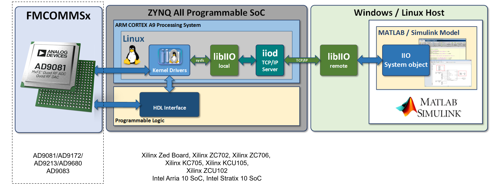

# FPGA Based System Architecture

The FPGA System Architecture is a high-level overview of how to use HDL, Linux drivers, bare-metal drivers, and application integrations to create a complete system. This article is intended to provide a high-level overview of how the different software components can be used together to create a complete system. FPGAs are typically used with ADI high-speed data converters, transceiver, and precision converters. ADI provides a number of reference designs for FPGA vendors like Xilinx, Altera, and Lattice.

## FPGA Reference Designs

All supported FPGA based systems will have a specific reference design that is used to validate the hardware and software components. These reference designs are build from common building blocks shared across FPGA families and vendors. They are also maintained across tool versions that go back many years. However, older revisions may have limited support. HDL itself is maintained in a single [github repository](https://github.com/analogdevicesinc/hdl), with releases created twice a year. For a complete list of reference designs please see the [HDL Reference Designs](https://wiki.analog.com/resources/fpga/docs/hdl) page.

The supported platforms are largely based on FPGA vendor supplied systems. This would systems directly sold by AMD or Altera, such as the AMD-ZCU102, or Altera Arria 10 GX. However, ADI modules like the ADRV9009-ZU11EG, will have supported reference designs as well. Other third party vendors are typically avoided since they may not have the same level of support as the main vendors. If there is a problem with the system the user is expected to contact the vendor directly and not ADI.

Architecturally, each reference design typically has a following data flow as show in the figure below. At a high level the default design is minimal but allow for control and data sending or retrieval from the external ADI component

```{d2}

:width: 90%

direction: right

style: {
    fill: transparent
}

ADI ADC Component -> FPGA Receive

FPGA Transmit -> ADI DAC Component

FPGA Receive {
    Interface IP -> Data Packing -> DDR Interface
}

FPGA Transmit {
    DDR Interface -> Data Unpacking -> Interface IP
}

```

## Software Support

To interface with the FPGA fabric and external ASICs, ADI provides drivers, userspace implementations, and bare-metal projects that run on the embedded systems. For all platforms for prototyping it is expected to have an embedded ARM, Microblaze, or Nios processor. End systems may have a different architecture, but this is how all reference designs are built.

:::{attention}
Two driver models are supported but we **highly recommend starting with the Linux driver implementation**. This is because it is easier to debug and has a richer development environment. Bare-metal drivers are typically used for systems that are in the optimization phase of their design, and developers have a good understanding of the system.
:::

### Linux Drivers

Linux drivers are always implemented first for FPGA based systems. Linux has a much richer development environment and is easier to debug than bare-metal systems in may cases. These drivers are implemented with a specific kernel subsystem depending on their application or purpose. Here is the typical breakdown of systems used:
- [Industrial I/O](https://wiki.analog.com/software/linux/docs/iio/iio): For data converters, transceivers, and frequency generation devices
- [PMBUS](https://wiki.analog.com/software/linux/docs/pmbus): For power management devices
- [HWMON](https://wiki.analog.com/software/linux/docs/hwmon): For temperature and voltage monitoring devices
- [MISC](https://wiki.analog.com/software/linux/docs/misc): For devices that do not fit into the above categories

The Linux drivers run within the Kernel on the embedded system. These drivers will bringup and configure the base FPGA and external ADI attached evaluation board or module. The drivers can be configured through the device tree or sysfs like any other Linux driver. For more details on which products are supported please see the [Linux Drivers](https://wiki.analog.com/resources/tools-software/linux-drivers) page. All drivers are maintained in a single [github repository](https://github.com/analogdevicesinc/linux).



#### Userspace Implementations

To provide a complete system to end-users, ADI supports a number of userspace implementations that can be used with the ADI Linux kernel. These include:
- [Kuiper Linux](kuiper_linux.md): An ADI specific distribution based on Raspbian that supports AMD, Altera, and Raspberry Pi platforms.
- [PetaLinux](petalinux.md): A AMD specific distribution based on the Yocto build system. This is only supported on specific AMD platforms through the meta-adi layer.
- [Buildroot](buildroot.md): A generic build system that can be used to build a minimal Linux system for any platform. Only a small number of specific projects have buildroot configurations.

### Bare-Metal Drivers

Bare-metal drivers are implemented for systems that do not have a Linux kernel or are not running an operating system. These drivers are implemented in C and are used to interface with the FPGA fabric and external ASICs. Since these bare-metal drivers follow the Linux implementations, they will have a similar structure and API. However, there user interface will be different since the kernel is limited to the sysfs and devicetree interfaces.

Bare-metal or typically what we referer to as "no-OS" drivers are implemented in a set of layers. The lowest layer is the HAL, which is the hardware abstraction layer. This layer is responsible for interfacing with the FPGA fabric and external ASICs. The next layer is the driver, which is responsible for interfacing with the HAL and providing a user interface. The last layer is the application, which is responsible for interfacing with the driver and providing a user interface.

- HAL: Different HALs are supported based on the FPGA vendor and family. They assume the use of ADI HDL and IP cores.
- Drivers: Drivers are implemented in C and mostly agnostic to the HAL. It is possible to use the with an RTOS environment or even with Linux through use of the UIO driver.
- Application: Applications for No-OS projects are generally very minimal. In some cases data streaming is supported, but this is not always the case.

For specific supported platforms, full projects are provided that piece together the HAL, required drivers, and application layer to start from. These projects are typically built with the Xilinx SDK, Altera Quartus, or Lattice Diamond IDEs.

### Application Integrations

To control the embedded system ADI heavily relies on an interface library call libiio which supports both Linux driver control and bare-metal control. However, for bare-metal projects scope very limited and project dependent. libiio is a C library that interfaces with drivers but also provides backends for remote control of the system as an RPC mechanism. To extend further libiio has bindings for a number of languages including Python, MATLAB, C++, C#, Rust, and others.

```{d2}

:width: 90%

Drivers -> libiio
libiio -> IIO-Tools
libiio -> IIO-Oscilloscope
libiio -> Language Bindings
libiio -> ADI MATLAB Toolboxes
libiio -> gr-iio (GNU Radio)

Language Bindings -> pyadi-iio: pylibiio
Language Bindings -> ACE: C# libiio


```

Through the use of libiio, users and control the end-system configuration, and even stream data back and forth through the FPGA.

For a list of common tools that can be used with or based on libiio see the [libiio applications page](https://wiki.analog.com/resources/tools-software/linux-software/libiio).