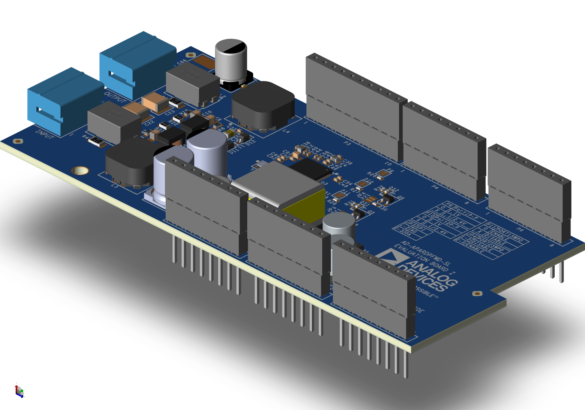
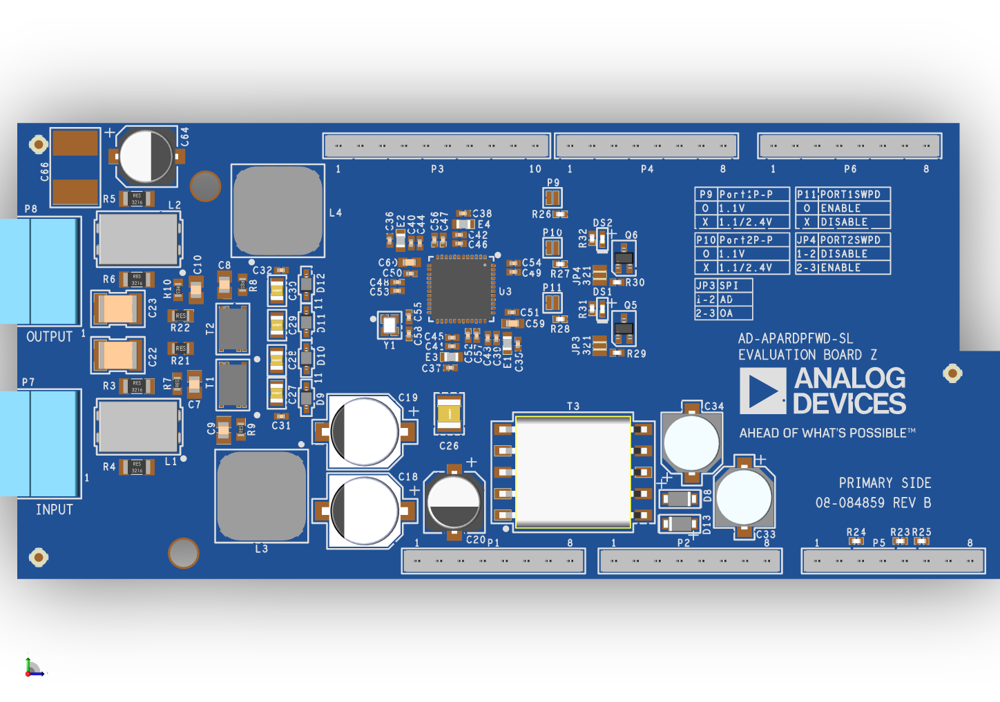
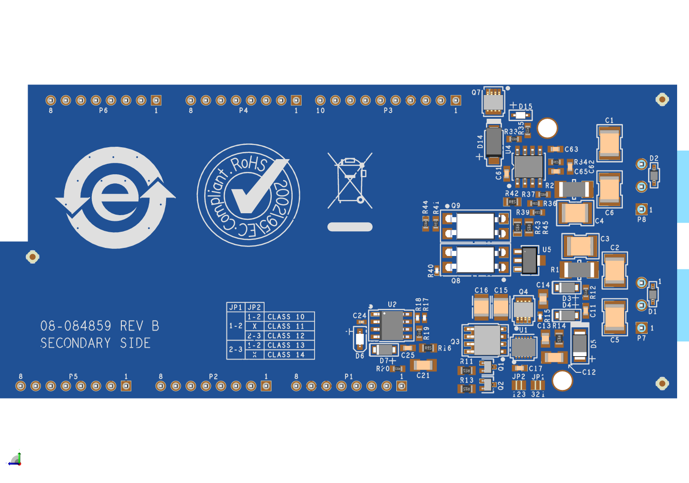
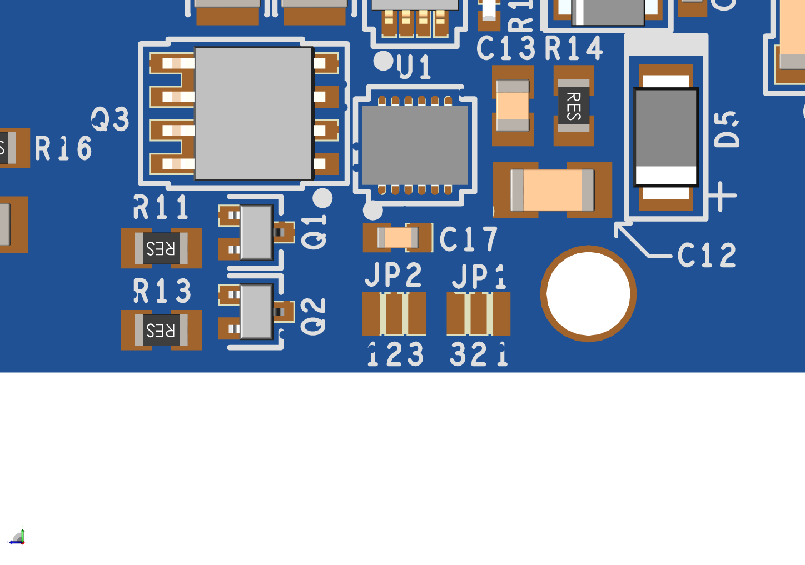
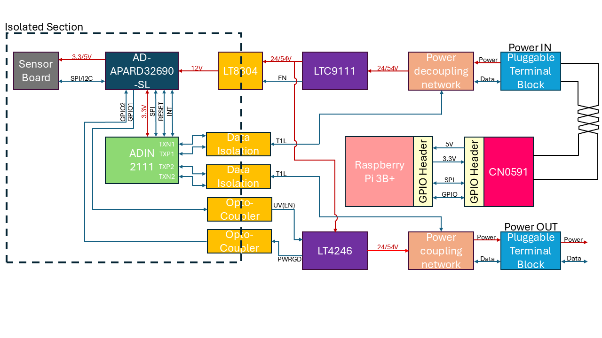

.. _ad-apardpfwd-sl:

AD-APARDPFWD-SL
================

10BASE-T1L Power Forwarding with Class 10-14 SPoE
"""""""""""""""""""""""""""""""""""""""""""""""""

General Description
-------------------

   AD-APARDPFWD-SL

The :adi:`AD-APARDPFWD-SL <AD-APARDPFWD-SL>` is a 10BASE-T1L power forwarder 
with Single Pair Power over Ethernet (SPoE) for development of field devices and
applications on a :adi:`AD-APARD32690-SL <AD-APARD32690-SL>` platform board. 
The SPoE powered device (PD) and isolated flyback regulator provide 12 V 
power to the platform board. SPoE Class 10-12 (24 V nominal) and 
Class 13-14 (55 V nominal) are supported.

Designed for use on the :adi:`AD-APARD32690-SL <AD-APARD32690-SL>` platform, 
the :adi:`AD-APARDPFWD-SL <AD-APARDPFWD-SL>` hardware features Arduino Mega
Form-factor headers, and two 10BASE-T1L ports for connecting to a
10BASE-T1L Power Sourcing Equipment (PSE) such as the 
:adi:`EVAL-CN0591-RPIZ <CN0591>` 2-port 10BASE-T1L w/SPoE PSE Development
Platform.

To allow board stacking and development of field device applications using
Arduino shields, the :adi:`AD-APARDPFWD-SL <AD-APARDPFWD-SL>` has extra tall 
headers that allows other Arduino shields to be stacked on top of it. 

The design also features a complete power and data isolation to the host 
:adi:`AD-APARD32690-SL <AD-APARD32690-SL>`.

Evaluation Board Hardware
-------------------------

Primary Side
~~~~~~~~~~~~

   AD-APARDPFWD-SL Primary Side

The :adi:`AD-APARDPFWD-SL <AD-APARDPFWD-SL>` uses 2 10BASE-T1L ports. One port 
is the input port (**P7**), which supplies power to the 
:adi:`AD-APARD32690-SL <AD-APARD32690-SL>` platform board, and the other port 
is the output port (**P8**), which can be used to connect to another 10BASE-T1L 
device or to daisy chain multiple devices. The input port is connected to the 
:adi:`LTC9111` SPoE PD controller, which extracts the SPoE power from the 
10BASE-T1L cable and provides it to the :adi:`LT8304` isolated flyback 
regulator. The :adi:`LT8304` provides a regulated 12V.

Power is supplied to the :adi:`AD-APARD32690-SL <AD-APARD32690-SL>` platform 
board via **PIN8** of the **P1** header.

The onboard :adi:`ADIN2111` PHY provides the 10BASE-T1L connection to the host 
platform board. The :adi:`ADIN2111` is connected to the :adi:`AD-APARD32690-SL 
<AD-APARD32690-SL>` platform board via the **P5** and uses the SPI4 port of the 
:adi:`AD-APARD32690-SL <AD-APARD32690-SL>`.

The :adi:`ADIN2111` feature selectable peek-to-peak transmit levels of 1.1V or
2.4V, which can be selected by shorting the **P9** and **P10** solder jumpers
for **PHY1** and **PHY2** respectively:

- Disconnected: 2.4V
- Shorted: 1.1V

The generic SPI protocol is half duplex. Therefore, it is not possible
to write frame data into the MAC_TX register and read from the
MAC_RX register at the same time. To achieve full duplex transmission on 
Ethernet at 10 Mbps, OPEN Alliance SPI must be used.
To select which SPI protocol to use, the **JP3** solder jumper should be
configured as follows:

.. csv-table::
   :file: ADIN2111_SPI_Selection.csv

The :adi:`ADIN2111` support software power-down after power-up / reset for each
port independently. To enable the software power-down feature for **PHY1** the 
**P11** jumper must be shorted. In order the enable the software power-down 
feature for **PHY2** the **JP4** solder jumper has to be configured as follows:

.. csv-table::
   :file: ADIN2111_Power_Down_Selection.csv

Secondary Side
~~~~~~~~~~~~~~

   AD-APARDPFWD-SL Secondary Side

SPoE PD Power Class Selection (JP1 and JP2)
^^^^^^^^^^^^^^^^^^^^^^^^^^^^^^^^^^^^^^^^^^^

By default, the :adi:`LTC9111` SPoE PD
controller included in the :adi:`AD-APARDPFWD-SL` circuit is configured for
PD Class 12. If a different PD class is required for the application, the
**JP1** and **JP2** solder jumpers should be reconfigured to match the desired
class.

   SPoE PD Power Class Jumpers

.. csv-table::
    :file: SPoE_PD_Power_Class_Selection.csv

.. warning::

   Do not use PD Classes 15!

   The :adi:`AD-APARDPFWD-SL <AD-APARDPFWD-SL>` evaluation board is not 
   designed to handle the class 15's power specifications.

System Setup
------------

**Required Equipment**

**Hardware**

- :adi:`AD-APARDPFWD-SL <AD-APARDPFWD-SL>` Circuit Evaluation Board
- :adi:`AD-APARD32690-SL <AD-APARD32690-SL>`

- Power Source, either:
  
  - :adi:`EVAL-CN0591-RPIZ <CN0591>` 2-port 10BASE-T1L w/SPoE PSE Development Platform
  
    - Raspberry Pi Model 3B (or higher)
    - Micro-SD Card for Raspberry Pi
  
  - Other 10BASE-T1L Power Coupling Network Board w/ SPoE PSE 

- :adi:`MAX32625PICO <MAX32625PICO>` or any other similar programmer supporting 
  the SWD interface

Block Diagram
~~~~~~~~~~~~~

Setup with SPoE via PSE 
^^^^^^^^^^^^^^^^^^^^^^^^^^^^^^^^^^^^^^^^^^

The :adi:`EVAL-CN0591-RPIZ <CN0591>` 2-port 10BASE-T1L w/SPoE PSE Development 
Platform provides a complete solution for powering the 
:adi:`AD-APARDPFWD-SL <AD-APARDPFWD-SL>` evaluation board and the 
:adi:`AD-APARD32690-SL <AD-APARD32690-SL>` platform board via SPoE.

   Test Setup with SPoE via PSE

Basic Operation
~~~~~~~~~~~~~~~
.. warning::

   To be replaced!!!

   Complete Evaluation Setup

To establish a 10BASE-T1L connection to an 
:adi:`AD-APARD32690-SL <AD-APARD32690-SL>` using the
:adi:`AD-APARDPFWD-SL <AD-APARDPFWD-SL>` evaluation board 
and ping the :adi:`AD-APARD32690-SL <AD-APARD32690-SL>`:

#. Ensure that the jumpers and switches of the :adi:`AD-APARDPFWD-SL <AD-APARDPFWD-SL>` are configured to the default settings.

#. Connect the :adi:`AD-APARDPFWD-SL <AD-APARDPFWD-SL>` circuit evaluation board to the 
   :adi:`AD-APARD32690-SL <AD-APARD32690-SL>` Arduino headers.

#. Operation with SPoE PSE:

   * Set the output of the PSE or DC power supply to either 24V (Class 12) or
     55V (Class 14), depending on the settings of **JP1** and **JP2** on the AD-APARDPFWD-SL board.
   * Using a PROFIBUS cable, connect **P1** or **P2** on the :adi:`EVAL-CN0591-RPIZ <CN0591>`
     evaluation board to **P1** on the :adi:`AD-APARD32690-SL <AD-APARD32690-SL>` platform board.

#. Upload the :git-no-OS:`AD-APARD32690-SL TCP Echo Server Example <projects/apard32690/src/examples/tcp_echo_server_example/>`
   to the :adi:`AD-APARD32690-SL <AD-APARD32690-SL>` platform board using the :adi:`MAX32625PICO <MAX32625PICO>` 
   programmer or any other similar programmer supporting the SWD interface.
   
#. By default the :adi:`AD-APARD32690-SL <AD-APARD32690-SL>` has 192.168.97.40 as its IP address.
   If you are using a different IP address, make sure to update the
   :git-no-OS:`AD-APARD32690-SL ADIN1110 Standalone Example <projects/apard32690/src/examples/adin1110_standalone_example/>`
   with the new IP address.

#. Update the IP address of the Raspberry Pi's Ethernet Interface depending on which port of the
   :adi:`EVAL-CN0591-RPIZ <CN0591>` you are using (**ETH1** / **ETH2**).

   .. warning::
        
        Add pictures of the IP change.

#. Wait for the **DS1** LED on the :adi:`AD-APARDPFWD-SL <AD-APARDPFWD-SL>` evaluation board
   and the **DS1** or **DS2** LED on the :adi:`EVAL-CN0591-RPIZ <CN0591>`
   evaluation board to turn on and start blinking at the same time.
   This indicates that a 10BASE-T1L link has been established.

#. Now you can ping the device to see if the connection is working properly.
   Open a terminal on your host PC and run the following command:

   .. shell::
      :user: analog
      :group: analog
      :show-user:

      $ping -I eth1 192.168.97.40

   .. warning:: ADD PICTURE!!!

Schematic, PCB Layout, Bill of Materials
----------------------------------------

.. admonition:: Download

  :download:`AD-APARDPFWD-SL Design & Integration Files<AD-APARDPFWD-SL-DesignSupport.zip>`

  - Schematics
  - PCB Layout
  - Bill of Materials
  - Allegro Project

Additional Information and Useful Links
---------------------------------------
- :adi:`ADIN2111 Product Page <ADIN2111>`
- :adi:`LTC9111 Product Page <LTC9111>`
- :adi:`LT8304 Product Page <LT8304>`

Hardware Registration
---------------------

.. tip::

   Receive software update notifications, documentation updates, view the latest
   videos, and more when you :adi:`register <AD-APARDPFWD-SL?&v=RevB>` your hardware.

Help and Support
-------------------

For questions and more information about this product, connect with us through the Analog Devices :ez:`/` .
