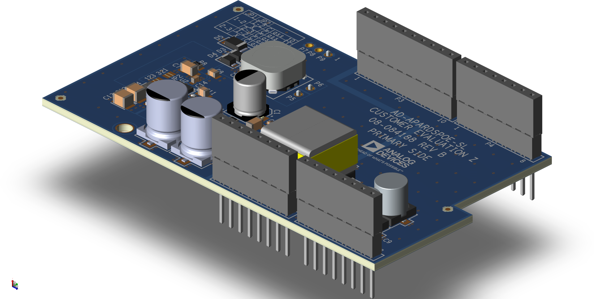
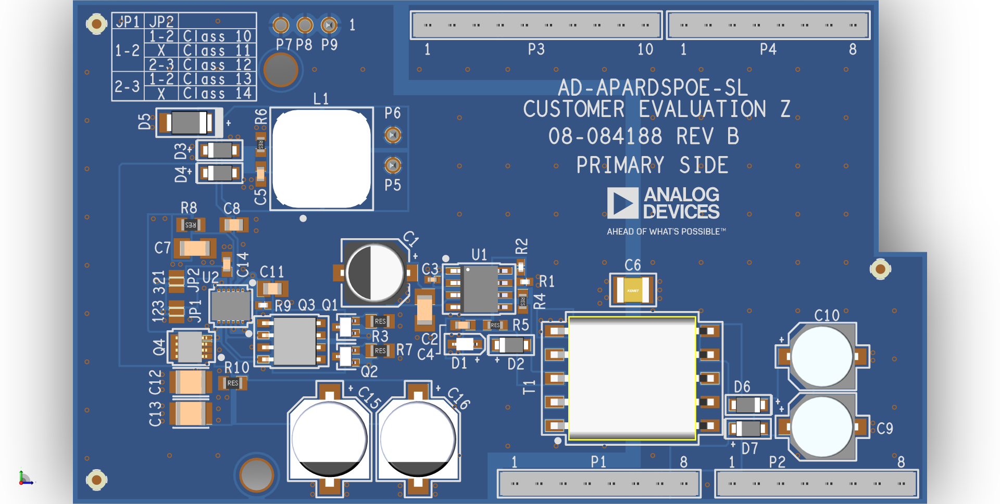
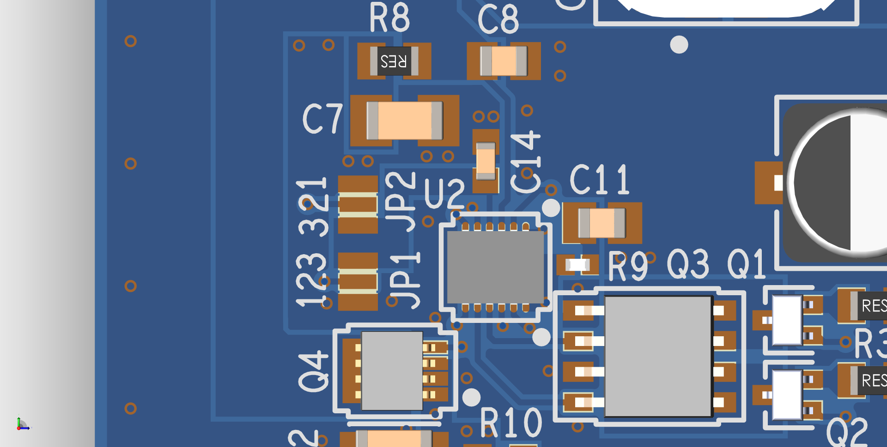
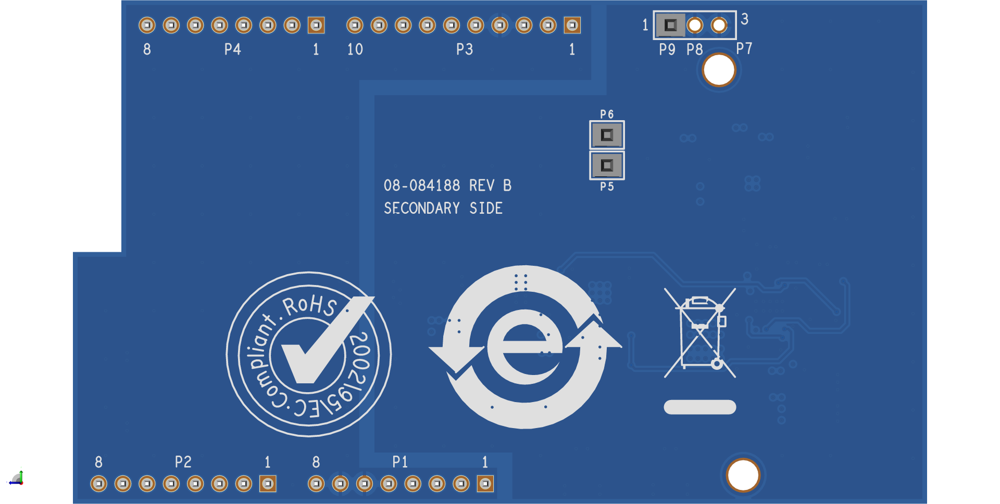
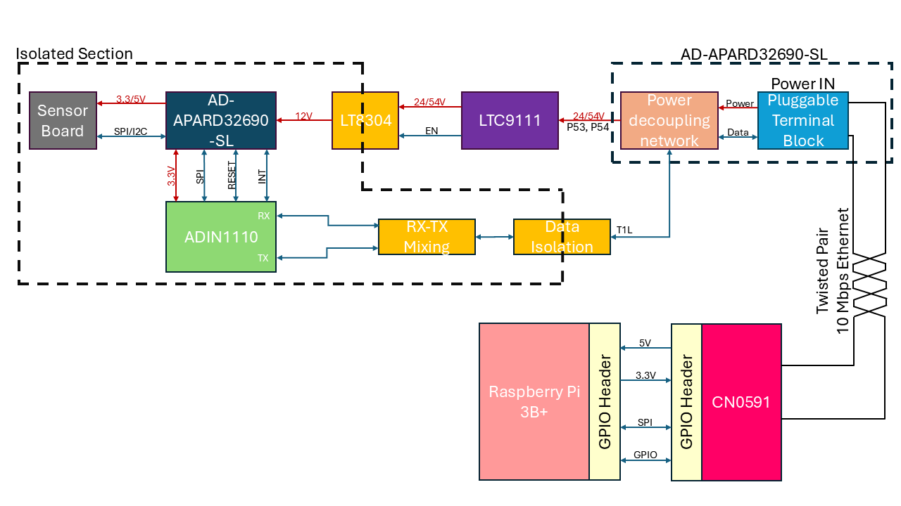

.. _ad-apardspoe-sl:

AD-APARDSPOE-SL
================

10BASE-T1L Power Extractor with Class 10-14 SPoE
""""""""""""""""""""""""""""""""""""""""""""""""""""""""""""""""""""""

General Description
-------------------

   AD-APARDSPOE-SL

The :adi:`AD-APARDSPOE-SL` is a 10BASE-T1L power extractor with Single Pair
Power over Ethernet (SPoE) for development of field devices and applications on
a :adi:`AD-APARD32690-SL` platform board. The SPoE powered device (PD) and
isolated flyback regulator provide 12 V power to the platform board. SPoE Class
10-12 (24 V nominal) and Class 13-14 (55 V nominal) are supported.

Designed for use on the :adi:`AD-APARD32690-SL` platform, the
:adi:`AD-APARDSPOE-SL` hardware features Arduino Form-factor headers, and 3
pins to extract power from the :adi:`AD-APARD32690-SL` board.

To support board stacking and the development of field device applications
using Arduino shields, the :adi:`AD-APARD32690-SL` is equipped with extra-tall
headers, enabling other Arduino shields to be stacked on top of it.

The design also features a complete power isolation to the host
:adi:`AD-APARD32690-SL`.

Evaluation Board Hardware
-------------------------

Primary Side
~~~~~~~~~~~~

   AD-APARDSPOE-SL Primary Side

The :adi:`AD-APARDSPOE-SL` uses 3 headers to connect to the
:adi:`AD-APARD32690-SL` platform board to extract the SPoE power:

- **P5** is for the negative voltage rail.
- **P6** is for the positive voltage rail.
- **P7** is for the ground rail.

Power is supplied to the :adi:`AD-APARD32690-SL` platform board
via **PIN8** of the **P1** header.

SPoE PD Power Class Selection (JP1 and JP2)
^^^^^^^^^^^^^^^^^^^^^^^^^^^^^^^^^^^^^^^^^^^

By default, the :adi:`LTC9111` SPoE PD
controller included in the :adi:`AD-APARDSPOE-SL` circuit is configured for
PD Class 12. If a different PD class is required for the application, the
**JP1** and **JP2** solder jumpers should be reconfigured to match the desired
class.

   SPoE PD Power Class Jumpers

.. csv-table::
    :file: SPoE_PD_Power_Class_Selection.csv

.. warning::

   Do not use PD Classes 15!

   The :adi:`AD-APARDSPOE-SL <AD-APARDSPOE-SL>` evaluation board is not designed to
   handle the class 15's power specifications.

Secondary Side
~~~~~~~~~~~~~~

   AD-APARDSPOE-SL Secondary Side

System Setup
------------

**Required Equipment**

**Hardware**

- :adi:`AD-APARDSPOE-SL` Circuit Evaluation Board
- :adi:`AD-APARD32690-SL`

- Power Source, either:

  - :adi:`EVAL-CN0591-RPIZ <CN0591>` 2-port 10BASE-T1L w/SPoE PSE Development Platform

    - Raspberry Pi Model 3B (or higher)
    - Micro-SD Card for Raspberry Pi

  - Other 10BASE-T1L Power Coupling Network Board w/ SPoE PSE

- :adi:`MAX32625PICO` or any other similar programmer supporting the SWD interface

Block Diagram
~~~~~~~~~~~~~

Setup with SPoE via PSE
^^^^^^^^^^^^^^^^^^^^^^^^^^^^^^^^^^^^^^^^^^

The :adi:`EVAL-CN0591-RPIZ <CN0591>` 2-port 10BASE-T1L w/SPoE PSE Development Platform
provides a complete solution for powering the :adi:`AD-APARDSPOE-SL <AD-APARDSPOE-SL>` evaluation board
and the :adi:`AD-APARD32690-SL <AD-APARD32690-SL>` platform board via SPoE.

   Test Setup with SPoE via PSE

Basic Operation
~~~~~~~~~~~~~~~

.. figure:: apard-pfwd-setup.png

   Complete Evaluation Setup

To establish a 10BASE-T1L connection to an :adi:`AD-APARD32690-SL` using the
:adi:`AD-APARDSPOE-SL` evaluation board and ping the :adi:`AD-APARD32690-SL`:

#. Ensure that the jumpers and switches of the :adi:`AD-APARDSPOE-SL` are
   configured to the default settings.

#. Connect the :adi:`AD-APARDSPOE-SL` circuit evaluation board to the
   :adi:`AD-APARD32690-SL` Arduino headers.

#. Using a USB-C cable, connect **P1** on the :adi:`AD-T1LUSB2.0-EBZ`
   evaluation board to a USB port on the computer.

#. Operation with SPoE PSE:

   * Set the output of the PSE or DC power supply to either 24V (Class 12) or
     55V (Class 14), depending on the settings of **JP1** and **JP2** on the AD-APARDSPOE-SL board.
   * Using a PROFIBUS cable, connect **P1** on the CN0591 evaluation board to **P1** on the :adi:`AD-APARD32690-SL <AD-APARD32690-SL>` evaluation board.
   * Using a PROFIBUS cable, connect **P2** on the CN0591 evaluation board to **P2** on the :adi:`AD-T1LUSB2.0-EBZ <ad-t1lusb20-ebz>` evaluation board.

#. Upload the :git-no-OS:`AD-APARD32690-SL TCP Echo Server Example <projects/apard32690/src/examples/tcp_echo_server_example>`
   to the :adi:`AD-APARD32690-SL <AD-APARD32690-SL>` platform board using the :adi:`MAX32625PICO` programmer.

#. By default the :adi:`AD-APARD32690-SL <AD-APARD32690-SL>` has 192.168.97.40 as its IP address.
   If you are using a different IP address, make sure to update the
   :git-no-OS:`AD-APARD32690-SL TCP Echo Server Example <projects/apard32690/src/examples/tcp_echo_server_example>`
   with the new IP address.

#. Update the IP address of the Raspberry Pi's Ethernet Interface depending on which port of the
   :adi:`EVAL-CN0591-RPIZ <CN0591>` you are using (**ETH1** / **ETH2**).

   .. warning::

        ADD STATIC IP FOR BOTH PORTS
        ETH1 192.168.97.10
        ETH2 192.168.90.10

   Save the table and reboot the system by entering the following command in the console:

   .. shell::
      :user: analog
      :group: analog
      :show-user:

      $sudo reboot

   * From the start menu open the **Control Panel** and click on **Network and Internet**
   * Click on **View network status and tasks**
      You should see two networks.

      .. figure:: ad-t1lusb2-network.png
         :width: 400 px

         Network Connections
   * Click on the **Connections: Ethernet** and click on **Properties**
   * Select **Internet Protocol Version 4 (TCP/IPv4)** and click on
     **Properties**
   * Select **Use the following IP address:** and type in the following **IP
     address** and **Subnet mask**:
     ::

         IP address: 192.168.90.zzz
         Subnet mask: 255.255.0.0

     where **zzz** is a number between 1 and 254, currently unused in the network (for example, 10 cannot be used, since it is used by the CN0591).
   * Click on **OK** to save the changes and close the dialog boxes.

#. Wait for the **DS3** LED on the :adi:`AD-APARD32690-SL` evaluation board
   and the **DS1** LED on the :adi:`EVAL-CN0591-RPIZ <CN0591>`
   evaluation board to turn on and start blinking at the same time.
   This indicates that a 10BASE-T1L link has been established.

#. Now you can ping the device to see if the connection is working properly.
   Open a terminal on your host PC connect to the CN0591 through SSH:

   ::

      ssh analog@192.168.90.10

   Enter the password **analog** when prompted.

   You can now ping the :adi:`AD-APARD32690-SL` platform board using the following command:

   .. shell::
      :user: analog
      :group: analog
      :show-user:

      $ping 192.168.97.50

   .. figure::
      apard-pfwd-result.png

      Result

Schematic, PCB Layout, Bill of Materials
----------------------------------------

.. admonition:: Download

  :download:`AD-APARDSPOE-SL Design & Integration Files<AD-APARDSPOE-SL-DesignSupport.zip>`

  - Schematics
  - PCB Layout
  - Bill of Materials
  - Allegro Project

Additional Information and Useful Links
---------------------------------------
- :adi:`ADIN1110 Product Page <ADIN1110>`
- :adi:`LTC9111 Product Page <LTC9111>`
- :adi:`LT8304 Product Page <LT8304>`

Hardware Registration
---------------------

.. tip::

   Receive software update notifications, documentation updates, view the latest
   videos, and more when you :adi:`register <AD-APARDSPOE-SL?&v=RevB>` your hardware.

Help and Support
-------------------

For questions and more information about this product, connect with us through the Analog Devices :ez:`/` .
