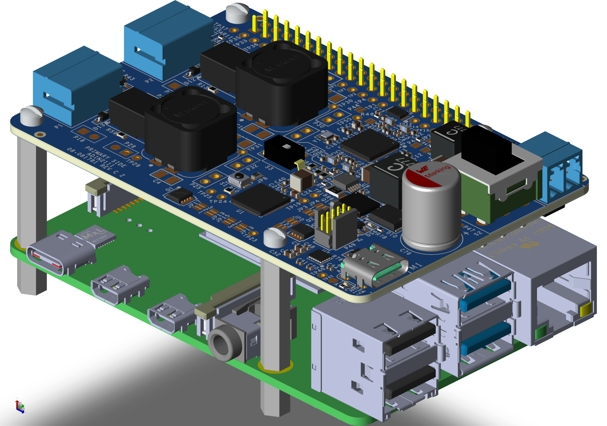
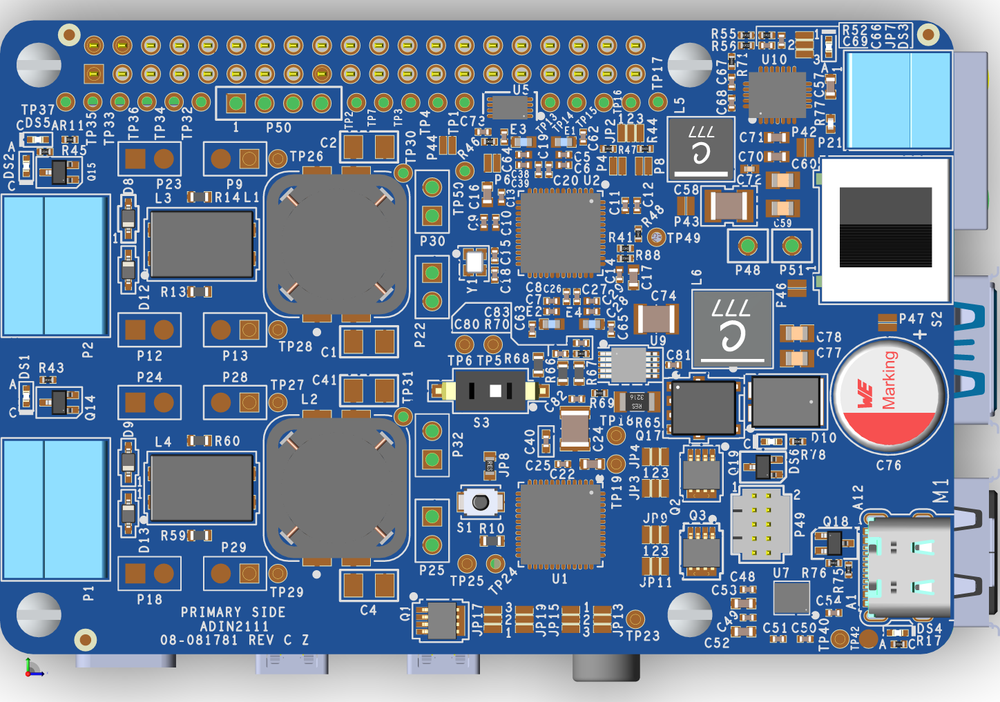
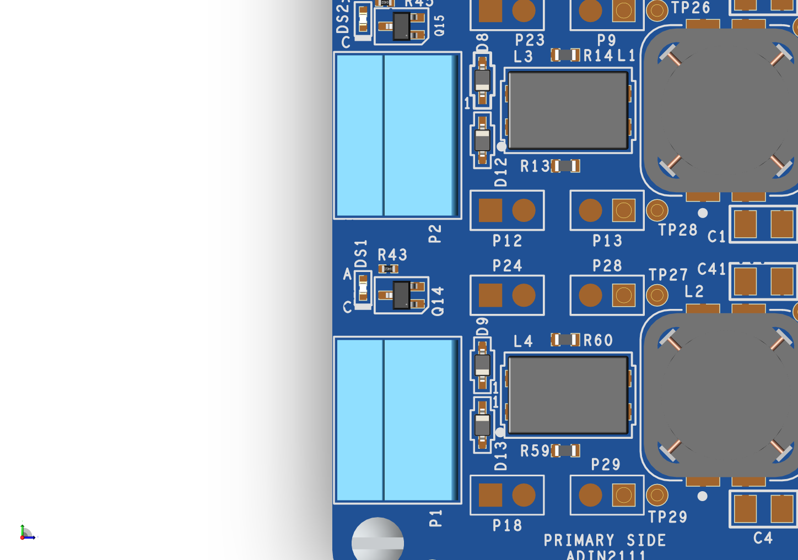
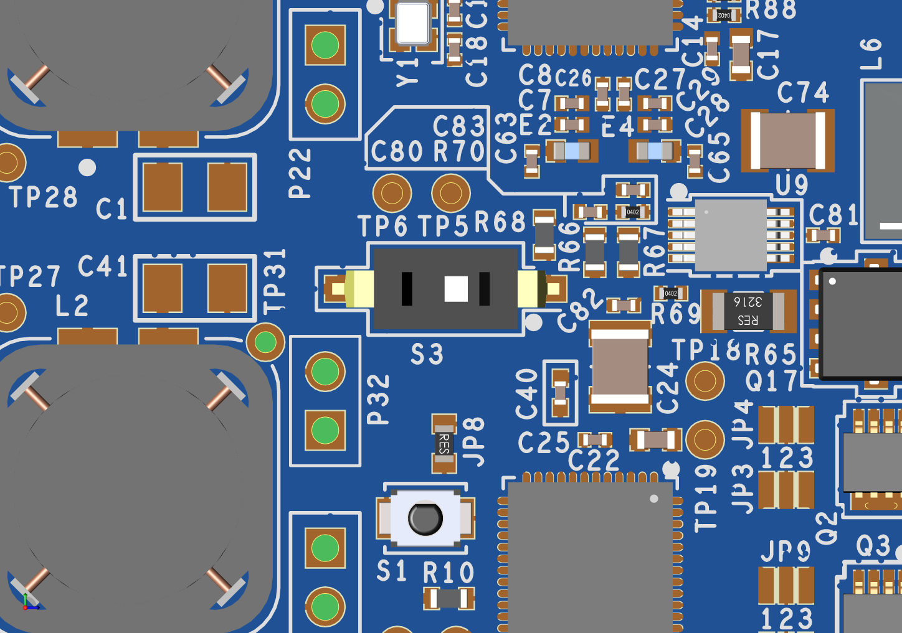
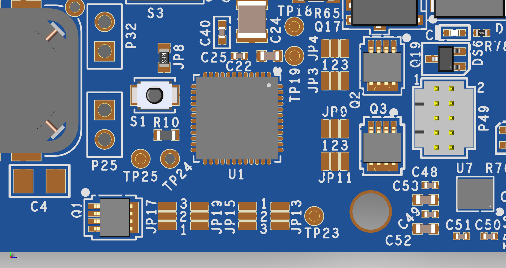
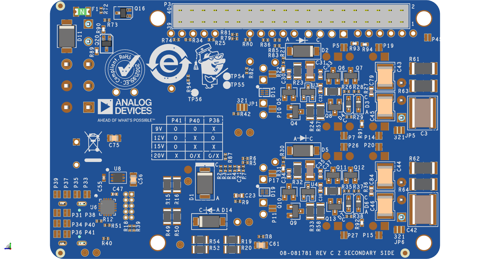
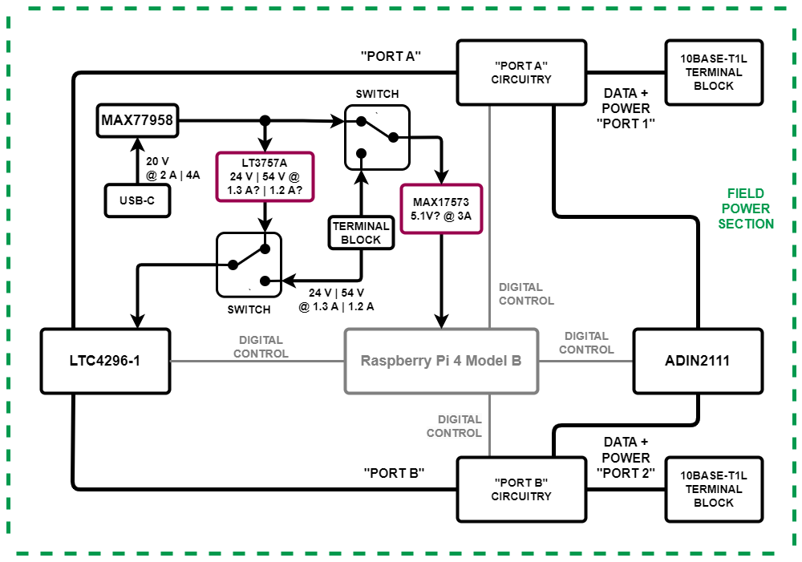
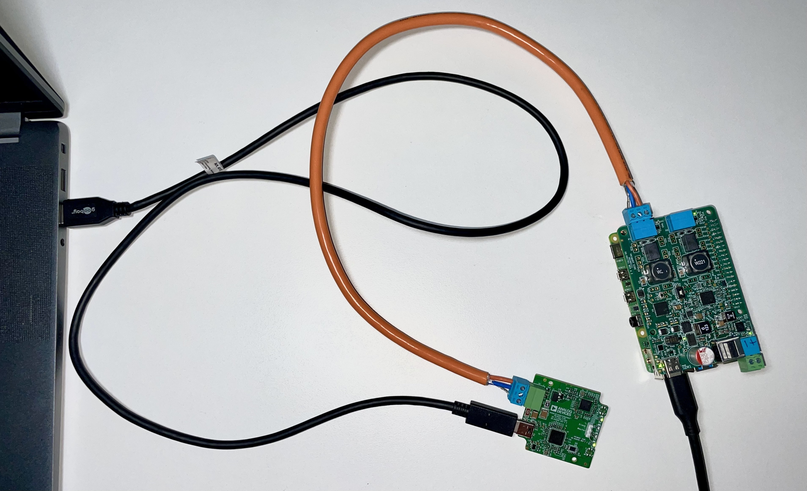

.. _eval-cn0591-rpiz:

EVAL-CN0591-RPIZ
================

2-port 10BASE-T1L Field Switch with SPoE PSE
""""""""""""""""""""""""""""""""""""""""""""""""""""""""""""""""""""""

General Description
-------------------

   EVAL-CN0591-RPIZ Board

The :adi:`EVAL-CN0591-RPIZ <CN0591>` is a 10BASE-T1L MAC/PHY interface with
Single Pair Power over Ethernet (SPoE) for development of field devices and
applications on a Raspberry Pi platform board. The device is a power sourcing 
equipment (PSE) that can be used to power other devices over the 10BASE-T1L
network. The board is powered via USB-C (**M1** up to 20V) or a Pluggable 
Terminal Block (**P21** up to 60V). A synchronous step-down DC-DC converter 
provides 5V power to the Raspberry Pi. SPoE Class 10-12 (24 V nominal) and 
Class 13-14 (55 V nominal) are supported.

Designed for use on the Raspberry Pi platform, the CN0591 hardware features a
40-pin GPIO header, and uses an extended verion of the standard HAT.

Evaluation Board Hardware
-------------------------

Primary Side
~~~~~~~~~~~~

   EVAL-CN0591-RPIZ Primary Side

10BASE-T1L Ports (P1 and P2)
^^^^^^^^^^^^^^^^^^^^^^^^^^^^

   10BASE-T1L Ports

The :adi:`EVAL-CN0591-RPIZ <CN0591>` evaluation board has 10BASE-T1L ports 
which can be connected to two PDs. The power sourcing and data transfer can be
controlled independently for each port.
**P1** and **P2** are 3-pin terminal blocks that can be used to connect a 
twisted pair cable with an optional shield. The ports supply a class dependent 
DC voltage to the connected PDs, and an AC coupled data signal for the 
10BASE-T1L communication. The ports are protected against overvoltage and ESD 
events.
In case the board is powerd via USB-C the default voltage will be 24V,
generated by :adi:`LT3757A <LT3757>` flyback boost converter used for classes 
10-12.
To utilize classes 13-14, 54V is generated by swtiching **S3**.

   SPoE Voltage Switch

The USB-C uses the :adi:`MAX77958 <MAX77958>` standalone USB Power Delivery 
(PD) controller, which can be programmed using the **P49** header. 
When power is supplied via the terminal block **P21**, the voltage can be set
to 24V or 55V using the customers power supply.
The supply port can be selected via the **S2** switch.

In either of the cases, to power the Raspberry Pi, 5V is generated using the 
:adi:`MAX17573`.

ADIN2111 
^^^^^^^^^

The onboard :adi:`ADIN2111` PHY provides the 10BASE-T1L connection to the host 
platform board. The :adi:`ADIN2111` is connected to the Raspberry Pi using the 
SPI0 port of the Raspberry Pi.

The :adi:`ADIN2111` feature selectable peek-to-peak transmit levels of 1.1V or
2.4V, which can be selected by shorting the **P6** and **P4** solder jumpers
for **PHY1** and **PHY2** respectively:

- Disconnected: 2.4V
- Shorted: 1.1V

The generic SPI protocol is half duplex. Therefore, it is not possible
to write frame data into the MAC_TX register and read from the
MAC_RX register at the same time. To achieve full duplex transmission on 
Ethernet at 10 Mbps, OPEN Alliance SPI must be used.
To select which SPI protocol to use, the **JP1** (located on the bottom of the 
board) solder jumper should be configured as follows:

.. csv-table::
   :file: ADIN2111_SPI_Selection.csv

The :adi:`ADIN2111` support software power-down after power-up / reset for each
port independently. To enable the software power-down feature for **PHY1** the 
**P8** jumper must be shorted. In order the enable the software power-down 
feature for **PHY2** the **JP2** solder jumper has to be configured as follows:

.. csv-table::
   :file: ADIN2111_Power_Down_Selection.csv

LTC4296
^^^^^^^

The :adi:`LTC4296<LTC4296-1>` is a five port, single-pair power over Ethernet 
(SPoE), power sourcing equipment (PSE) controller. The LTC4296-1 is designed 
for interoperability with powered devices (PDs) in 24 V or 54 V systems.
PD classification via the serial communication classification protocol (SCCP) 
and maintain full voltage signature (MFVS) ensure full operating voltage is 
only applied to the cable when a PD is present. PD initiated sleep and wake-up 
are supported.
Telemetry, status, and software control features are accessed via SPI bus 
interface with packet error code (PEC) protection.

The LTC4296 is directly powered from the :adi:`LT3757A <LT3757>` flyback boost 
converter or from the 24V or 55V power supply connected to the **P21** terminal 
block.

The device by default is configured to operate in SPoE Class 12 (24V nominal) or
SPoE Class 14 (54V nominal) mode. In order to use classes 11 and 13, the 
following solder jumper configurations are required:

   SPoE PD Power Class Jumpers

.. csv-table:: SPoE PSE High Side Circuit Breaker Resistor Selection Table
   :file: SPoE_PSE_Power_Class_Selection_High_Side.csv
   
.. csv-table:: SPoE PSE Low Side Sensing Resistor Selection Table
   :file: SPoE_PSE_Power_Class_Selection_Low_Side.csv

The LTC4296 supports SPoE Class 10 as well. For this the high side circuit 
breaker resistors have to be changed **R15** or **R16** for **PORT1** and
**R49** or **R50** for **PORT2** to **1.6Ω, 1/10W** resistors. At the same time 
the low side sensing resistor have to be changed **R19** or **R20** for 
**PORT1** and **R53** or **R54** for **PORT2** to **0.4Ω, 1/10W** resistors.

The complete power requirements for the SPoE classes are shown in the table below:

.. csv-table:: SPoE PSE Power Class Requirements
   :file: SPoE_PSE_Power_Class_Requirements.csv
   
Secondary Side
~~~~~~~~~~~~~~

   EVAL-CN0591-RPIZ Secondary Side

The secondary side of the :adi:`EVAL-CN0591-RPIZ <CN0591>` evaluation board
features a Raspberry Pi compatible 40-pin GPIO header, which is used to
connect the board to the Raspberry Pi and the serial communication and 
classification protocol (SCCP) drivers. 
The USB-C uses a standalone USB Power Delivery (PD) controller, can be 
configured using the following jumper configurations:

.. csv-table:: USB-C Power Delivery Controller Configuration
   :file: USB_PD_Controller_Configuration.csv

.. warning:: 

   Though the PD support 5V inputs, we do not recommend using it, since the 
   :adi:`MAX17573` requires voltages above 5V to generate 5V for 
   the Raspberry Pi.

.. attention::
   Using a power source with a voltage of 9V is not recommend for 
   class 14 without extrenal active cooling, since the boost converter 
   generates a lot of heat which might cause damage to the Raspberry Pi or to 
   the :adi:`EVAL-CN0591-RPIZ <CN0591>` evaluation board.

   **A power supply of at least 15V is recommend to ensure that the excess heat 
   does not damage the system.**

System Setup
------------

**Required Equipment**

**Hardware**

- :adi:`EVAL-CN0591-RPIZ <CN0591>` Circuit Evaluation Board
- Raspberry Pi Model 3B (or higher)
- Micro-SD Card for Raspberry Pi
- 10BASE-T1L media converter, either:

  - :adi:`EVAL-ADIN1100EBZ <eval-adin1100>` Product Evaluation Board
  - :adi:`AD-T1LUSB2.0-EBZ <ad-t1lusb20-ebz>` USB2.0 to 10BASE-T1L Interface Board 
  - Other 10BASE-T to 10BASE-T1L media converter

- Power Source, either:

  - DC Power Supply with USB-C
  - Any extrenal DC power supply with 24V or 55V output

- Host Windows, Linux, or Mac computer

**Software**

- :ref:`kuiper`

**Documentation**

- :adi:`CN0591` Circuit Note

Block Diagram
~~~~~~~~~~~~~

Setup with DC Power Supply with USB-C or other DC Power Supply
^^^^^^^^^^^^^^^^^^^^^^^^^^^^^^^^^^^^^^^^^^^^^^^^^^^^^^^^^^^^^^

   EVAL-CN0591-RPIZ Block Diagram

Software Setup
~~~~~~~~~~~~~~

Downloading and Flashing the Micro-SD Card
^^^^^^^^^^^^^^^^^^^^^^^^^^^^^^^^^^^^^^^^^^

To use the :adi:`EVAL-CN0591-RPIZ <CN0591>` with the Raspberry Pi, the
micro-SD card should be preloaded with :ref:`kuiper`, a distribution based on 
Raspbian from the Raspberry Pi Foundation that incorporates Linux drivers for 
ADI products as well as tools and other software products.

Complete instructions, including where to download the SD card image, how to
write it to the micro-SD card, and how to configure the system are provided at
:ref:`kuiper`.

Configuring the Micro-SD Card
^^^^^^^^^^^^^^^^^^^^^^^^^^^^^

The Linux kernel requires a matching device tree overlay to identify the
devices on the CN0591. The overlay table is included with the :ref:`kuiper`
and simply needs to be enabled.

To do this, follow the Hardware Configuration procedure under **Configuring
the SD Card for Raspberry Pi Projects** in the :ref:`kuiper` page.
Enable the CN0591 overlay by adding the following line to *config.txt*
for class 12:

::

   dtoverlay=rpi-cn0591-class12

or for class 14:

::

   dtoverlay=rpi-cn0591-class14

.. attention::

      ADD STATIC IP

Save the table and reboot the system by entering the following command in the console:

.. shell::
   :user: analog
   :group: analog
   :show-user:

   $sudo reboot

Basic Operation
~~~~~~~~~~~~~~~

   Complete Evaluation Setup

To establish a 10BASE-T1L connection to a Raspberry Pi using the
:adi:`EVAL-CN0591-RPIZ <CN0591>` evaluation board and ping the Raspberry Pi 
follow the below procedure:

#. Ensure that the jumpers and switches of the :adi:`EVAL-ADIN1100EBZ <eval-adin1100>` are configured to the default settings.

#. Insert the micro-SD card into its slot on the Raspberry Pi.

#. Connect the :adi:`EVAL-CN0591-RPIZ <CN0591>` circuit evaluation board to the Raspberry Pi GPIO header.

#. Using a twisted-pair cable, connect **P2** on the
   :adi:`AD-T1LUSB2.0-EBZ <ad-t1lusb20-ebz>` USB2.0 to 10BASE-T1L Interface
   to the **P1** terminal block on the :adi:`EVAL-CN0591-RPIZ <CN0591>`

#. Using a USB-C cable, connect **P1** on the
   :adi:`AD-T1LUSB2.0-EBZ <ad-t1lusb20-ebz>` evaluation board to a USB port on
   the computer.

#. *Operation with USB-C DC Power Supply: (Skip to step 7 if using a the P21 terminal block)*

   * Set the **S3** switch to supply to either 24V (Class 12) or
     55V (Class 14), depending on the overlay added to the *config.txt*.
   * Set the **S2** switch towards the **USB-C**.

#. *Operation with external DC Power Supply (Using the P21 terminal block):*

   * Using wires, connect the **P21** terminal block on the :adi:`EVAL-CN0591-RPIZ <CN0591>`
   * Set the **S2** switch towards the **Terminal Block**. 

#. Wait for the **DS1** LED on the :adi:`EVAL-CN0591-RPIZ <CN0591>` circuit
   evaluation board and the **DS1**, **DS2** LEDs on the 
   :adi:`EVAL-ADIN1100EBZ <EVAL-ADIN1100>` evaluation board to turn on and
   start blinking at the same time. This indicates that a 10BASE-T1L link has 
   been established.

#. On the host PC, change the IP address of the AD-T1LUSB2.0-EBZ:

   * From the start menu open the **Control Panel** and click on **Network and Internet**
   * Click on **View network status and tasks**
      You should see two networks.

      .. figure:: ad-t1lusb2-network.png
         :width: 400 px

         Network Connections
   * Click on the **Connections: Ethernet** and click on **Properties**
   * Select **Internet Protocol Version 4 (TCP/IPv4)** and click on 
     **Properties**
   * Select **Use the following IP address:** and type in the following **IP 
     address** and **Subnet mask**:
     ::

         IP address: 192.168.90.zzz
         Subnet mask: 255.255.0.0

     where **zzz** is a number between 1 and 254, currently unused in the network (for example, 10 cannot be used, since it is used by the CN0591).
   * Click on **OK** to save the changes and close the dialog boxes.

#. Open up a terminal and ping the CN0591:
   ::

      ping 192.168.90.10 

   .. figure:: ping-result.png
      :width: 400 px

      Result

Schematic, PCB Layout, Bill of Materials
----------------------------------------

.. admonition:: Download

  :download:`EVAL-CN0591-RPIZ Design & Integration Files <CN0591-DesignSupport.zip>`

  - Schematics
  - PCB Layout
  - Bill of Materials
  - Allegro Project

Additional Information and Useful Links
---------------------------------------

- :adi:`CN0591 Design Support Package <CN0591-DesignSupport>`
- :adi:`CN0591 Circuit Note Page <CN0591>`
- :adi:`ADIN2111 Product Page <ADIN2111>`
- :adi:`MAX17573 Product Page <MAX17573>`
- :adi:`MAX77958 Product Page <MAX77958>`
- :adi:`LTC4296 Product Page <LTC4296-1>`
- :adi:`LT3757A Product Page <LT3757>`
- :dokuwiki:`ADIN2111 Linux Driver <resources/tools-software/linux-drivers/net-mac-phy/adin2111>`

Hardware Registration
---------------------

.. tip::

   Receive software update notifications, documentation updates, view the latest
   videos, and more when you :adi:`register <EVAL-CN0591-RPIZ?&v=RevC>` your hardware.

Help and Support
-------------------

For questions and more information about this product, connect with us through the Analog Devices :ez:`/` .
